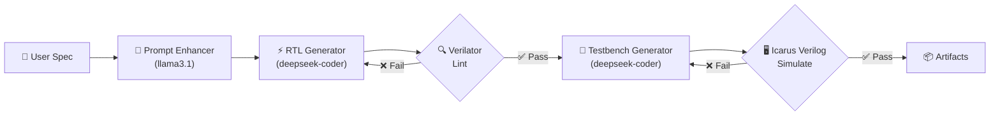

# 🤖 Agentic RTL Coder

[](LICENSE)
[](https://www.python.org)
[](https://github.com/ManishSwarnakar/Agentic_RTL_Coder/actions)

**AI-powered Verilog RTL generation with self-correcting lint & simulation feedback loops.**

Agentic RTL Coder takes a plain-English hardware design spec, enhances it with an LLM, generates synthesisable Verilog, and then *autonomously fixes* lint and simulation errors by feeding tool output back to the model — all running locally via [Ollama](https://ollama.com).

---

## ✨ Key Features

- **Agentic feedback loops** — lint errors from Verilator and simulation failures from Icarus Verilog are automatically fed back to the LLM for self-correction (up to N retries).
- **Fully local** — runs entirely on your machine using Ollama. No API keys, no cloud.
- **Configurable models** — swap in any Ollama model via CLI flags.
- **Complete audit trail** — every intermediate artifact (raw LLM output, logs, VCD waveforms) is preserved for inspection.

---

## 🏗️ Architecture



Each failing stage feeds its error log back into the LLM prompt, creating a closed-loop self-correction cycle.

---

## 📋 Prerequisites

| Tool | Version | Install |
|---|---|---|
| **Python** | ≥ 3.10 | [python.org](https://www.python.org/downloads/) |
| **Ollama** | latest | [ollama.com](https://ollama.com/download) |
| **Verilator** | ≥ 4.0 | `apt install verilator` / [verilator.org](https://verilator.org) |
| **Icarus Verilog** | ≥ 11.0 | `apt install iverilog` / [iverilog wiki](https://steveicarus.github.io/iverilog/) |

Pull the required Ollama models before first use:

```bash
ollama pull llama3.1
ollama pull deepseek-coder-v2
```

---

## 🚀 Quick Start

### Install

```bash
git clone https://github.com/ManishSwarnakar/Agentic_RTL_Coder.git
cd Agentic_RTL_Coder
pip install -e .
```

### Run

```bash
# With inline spec
python agentic_rtl_coder.py --spec "4-bit synchronous up-counter with async reset"

# Or interactively (you'll be prompted)
python agentic_rtl_coder.py
```

### Output

All artifacts are written to `rtl_pipeline_work/`:

```
rtl_pipeline_work/
├── design.v              # Generated Verilog RTL
├── testbench.v           # Generated testbench
├── tb.vcd                # Waveform dump
├── sim.out               # Compiled simulation binary
├── rtl_gen_raw.txt       # Raw LLM output (RTL)
├── tb_raw.txt            # Raw LLM output (testbench)
├── enhanced_prompt.txt   # Enhanced spec
├── lint.log              # Verilator lint results
├── compile.log           # iverilog compile output
├── simulation.log        # vvp runtime output
├── design_info.json      # Run metadata
└── README.md             # Auto-generated summary
```

View waveforms (optional):

```bash
gtkwave rtl_pipeline_work/tb.vcd
```

---

## ⚙️ Configuration

All settings are configurable via CLI flags:

```
Usage: agentic_rtl_coder [OPTIONS]

Options:
  --spec, -s TEXT          Design specification text
  --prompt-model TEXT      Ollama model for prompt enhancement
                           (default: llama3.1:latest)
  --rtl-model TEXT         Ollama model for RTL & testbench generation
                           (default: deepseek-coder-v2:latest)
  --max-retries, -r INT    Max retry attempts per stage (default: 25)
  --timeout, -t INT        Timeout per Ollama call in seconds (default: 600)
  --keep-workdir           Don't delete previous workdir
  --verbose, -v            Enable debug logging
```

### Examples

```bash
# Use a different model
python agentic_rtl_coder.py \
  --spec "8-bit ALU with add, sub, and, or" \
  --rtl-model codellama:13b

# Quick iteration with fewer retries
python agentic_rtl_coder.py \
  --spec "simple FIFO" \
  --max-retries 5 \
  --verbose
```

---

## 🧪 Running Tests

```bash
pip install -e ".[dev]"
pytest
```

---

## 🤝 Contributing

Contributions are welcome! See [CONTRIBUTING.md](CONTRIBUTING.md) for guidelines on:

- Setting up your development environment
- Running tests and linters
- Submitting pull requests

---

## 📄 License

This project is licensed under the [MIT License](LICENSE).

---

## 🙏 Acknowledgements

- [Ollama](https://ollama.com) — local LLM inference
- [Verilator](https://verilator.org) — fast Verilog lint & simulation
- [Icarus Verilog](https://steveicarus.github.io/iverilog/) — open-source Verilog simulation
